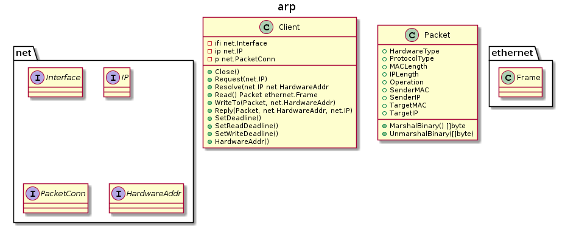

raw [](https://travis-ci.org/caser789/arp)
[](https://godoc.org/github.com/caser789/arp)
[](https://goreportcard.com/report/github.com/caser789/arp)
[](https://coveralls.io/r/caser789/arp?branch=master)
=====



```
@startuml

title arp

interface net.Interface {}
interface net.IP {}
interface net.PacketConn {}
interface net.HardwareAddr {}

class ethernet.Frame {}

class Client {
    -ifi net.Interface
    -ip net.IP
    -p net.PacketConn
    +Close()
    +Request(net.IP)
    +Resolve(net.IP net.HardwareAddr
    +Read() Packet ethernet.Frame
    +WriteTo(Packet, net.HardwareAddr)
    +Reply(Packet, net.HardwareAddr, net.IP)
    +SetDeadline()
    +SetReadDeadline()
    +SetWriteDeadline()
    +HardwareAddr()
}

class Packet {
    +HardwareType
    +ProtocolType
    +MACLength
    +IPLength
    +Operation
    +SenderMAC
    +SenderIP
    +TargetMAC
    +TargetIP
    +MarshalBinary() []byte
    +UnmarshalBinary([]byte)
}

@enduml
```
